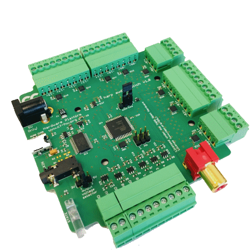

## Harp AudioSwitch ##

This is a multiplexer device that allows an analog input signal to be forwarded to several output channels. It allows forwarding an audio signal to a single speaker or a combination of speakers. The configuration of speakers can be predefined by software or by using a set of digital inputs.

### Key Features ###

* Configuration of up to 15 speakers (depending on the input signal strength)
* Several speakers can be activated concurrently

### Connectivity ###

* 1x stereo jack for clock sync input (CLKIN)
* 1x USB (for computer) 1x power barrel connector jack (5V only) 1x screw terminal connector for output power (GND, +5V) 1x screw terminal connector for speaker configuration (GND, DOUT0, GND, DIN0 to DIN4)

## Interface ##

The interface with the Harp board can be done through [Bonsai](https://bonsai-rx.org/) or a dedicated GUI (Graphical User Interface).

In order to use this GUI, there are some software that needs to be installed:

1 - Install the [drivers](https://bitbucket.org/fchampalimaud/downloads/downloads/UsbDriver-2.12.26.zip).

2 - Install the [runtime](https://bitbucket.org/fchampalimaud/downloads/downloads/Runtime-1.0.zip).

3 - Reboot the computer.

4 - Install the [GUI](https://bitbucket.org/fchampalimaud/downloads/downloads/Harp%20Audio%20Switch%20v1.0.0.zip).

## Licensing ##

Each subdirectory will contain a license or, possibly, a set of licenses if it involves both hardware and software.